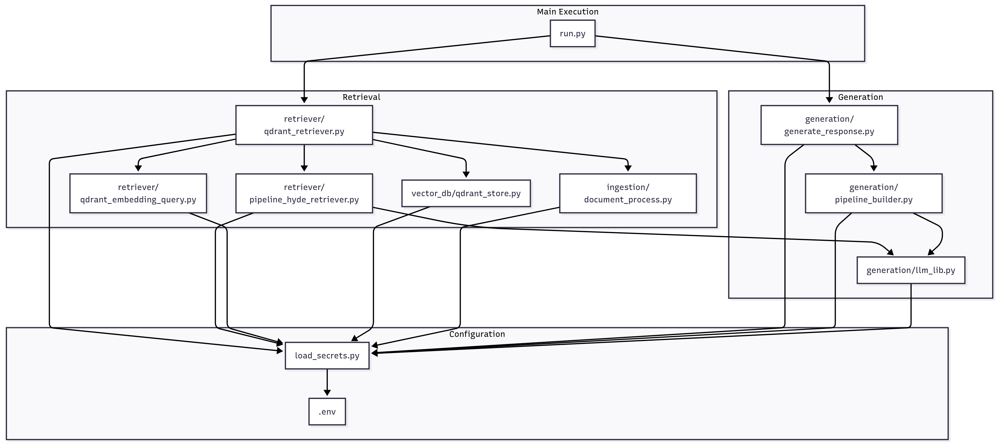

# Modèle de RAG (Retrieval-Augmented Generation)

Ce projet est un modèle d'application RAG (Retrieval-Augmented Generation). Il est conçu pour servir de base à la création de chatbots et d'assistants capables de répondre à des questions complexes en s'appuyant sur une base de connaissances fournie. Le principe du RAG consiste à ingérer un ensemble de documents, à les analyser et à les stocker dans une base de données vectorielle. Lorsqu'une question est posée, l'application recherche les informations les plus pertinentes dans sa base de connaissances et utilise un modèle de langage (LLM) pour formuler une réponse précise et contextualisée.

## Utilisation et installation

1.  **Clonez le dépôt :**
    ```bash
    git clone <url-du-depot>
    cd <nom-du-depot>
    ```

2. **Créer le fichier de configuration :**
    ```
    cp .env.example .env
    ```
    > Modifier le choix du provider :
        (modifier en conséquence les autres variables du fichier)
    ```bash
    PROVIDER="portkey"
    ```
    Ou bien :
    ```bash
    PROVIDER="ollama"
    ```

### Ne pas oublier d'ajouter ses documents avant l'ingestion avec UNIQUEMENT les extensions suivantes : `PDF, JSON, CSV, TXT, MD`
    Note : ne pas mettre d'espaces ni de caratères pour le titre des documents lors de l'ingestion


## Utilisation du RAG par CLI (Command Line Interface)

### Méthode 1 : Par fichier shell

3. **Lancer le script shell :**
    ```bash
    chmod +x ./run.sh
    ./run.sh
    ```

### Méthode 2 : Par le terminal

3. **Créer un fichier d'environnement virtuel python et l'activer**
    ```bash
    python3 -m venv venv
    source venv/bin/activate
    ```

4. **Installer les dépendances :**
    ```bash
    pip install -r requirements.txt
    ```

5.  **Lancer la base de donnée vectorielle par docker:**
    ```bash
    docker compose up qdrant -d
    ```

6. **Initialiser les documents dans la base vectorielle :**
    ```bash
    python3 -m app.ingestion.ingest
    ```

7. **Exécuter le script python :**
    ```bash
    python3 app_cli.py
    ```

## Utilisation du RAG via Streamlit (interface web)

3. **Lancer la base de donnée vectorielle par docker:**
    ```bash
    docker compose up qdrant -d
    ```

4. **Ouvrir l'interface Streamlit :**
    Aller sur le port `http://localhost:8501`
    Lors de la première utilisation, lancez l'ingestion des documents et posez une première question pour initialiser le modèle d'embedding.
    L'initialisation du modèle d'embedding peut prendre jusqu'à 5 minutes.

## Clé Portkey

Portkey est un proxy qui unifie l'accès à de multiples fournisseurs de LLM (OpenAI, Claude, Groq, etc.). Voici comment configurer votre clé :

1.  Créez un compte sur [Portkey](https://portkey.ai/).
2.  Ajoutez un fournisseur de modèle depuis le [catalogue de modèles](https://app.portkey.ai/model-catalog/providers).
3.  Cliquez sur `+add new integration`, donnez-lui un nom et définissez un slug (par défaut `rag_llm`).
4.  Renseignez la clé API de votre fournisseur.
5.  Copiez le nom du modèle souhaité depuis le [catalogue](https://app.portkey.ai/model-catalog) et collez-le dans la variable `GENERATION_MODEL` de votre fichier `.env`.
6.  Générez une clé API Portkey dans la section [API Keys](https://app.portkey.ai/api-keys) et copiez-la dans la variable `PORTKEY_KEY` de votre `.env`.

## Configuration

Voici la liste des variables d'environnement que vous pouvez définir :

| Variable | Description | Défaut |
| --- | --- | --- |
| `EMBEDDING_MODEL` | Modèle d'embedding à utiliser. | `sentence-transformers/distiluse-base-multilingual-cased-v2` |
| `EMBED_DIM` | Dimension des embeddings. | `512` |
| `CHUNK_SIZE` | Taille des chunks pour le découpage des documents. | `1024` |
| `CHUNK_OVERLAP` | Chevauchement entre les chunks. | `300` |
| `USE_GPU` | Mettre à `true` pour utiliser le GPU. | `false` |
| `RAG_METHOD` | Méthode de RAG (`similarity` ou `hyde`). | `similarity` |
| `FILE_DIR` | Dossier contenant les fichiers à ingérer (PDF, CSV, JSON). | `./docs` |
| `PROMPTS_DIR` | Dossier contenant les prompts du RAG en format `.j2` | `./app/prompts` |
| `CSV_DELIMITER` | Délimiteur pour les fichiers CSV. | `,` |
| `PROVIDER` | Fournisseur de LLM (`ollama` ou `portkey`). | `ollama` |
| `GENERATION_MODEL`| Modèle de génération à utiliser. | `meta-llama/llama-3.3-70b-instruct:free` |
| `HYDE_MODEL` | Modèle pour la génération de document hypothétique (HyDE). | `mistralai/devstral-small-2505:free` |
| `PORTKEY_KEY` | Clé API pour Portkey. | |
| `SLUG_PORTKEY` | Slug pour Portkey. | `rag_llm` |
| `OLLAMA_HOST` | Hôte pour Ollama. | `http://localhost:11434` |
| `TEMPERATURE` | Température pour la génération de la réponse. | `0` |
| `TOP_K` | Nombre de documents à récupérer. | `10` |
| `RERANKER_ENABLE` | Activer le reranker. | `true` |
| `RERANKER_TOP_K` | Nombre de documents à garder après le reranking. | `3` |
| `CROSS_ENCODER` | Modèle de cross-encoder à utiliser pour le reranking. | `cross-encoder/ms-marco-MiniLM-L-6-v2` |

## Stack Technique

Ce projet utilise les technologies suivantes :

-   **Framework RAG**: [Haystack](https://haystack.deepset.ai/) pour l'orchestration de la pipeline de Retrieval-Augmented Generation.
-   **Base de Données Vectorielle**: [Qdrant](https://qdrant.tech/) pour le stockage et la recherche des embeddings de documents.
-   **Modèles d'Embedding**: [SentenceTransformers](https://www.sbert.net/) pour la création des représentations vectorielles des textes.
-   **Fournisseurs de LLM**:
    -   [Ollama](https://ollama.ai/) pour l'exécution de modèles de langage en local.
    -   [Portkey](https://portkey.ai/) comme passerelle pour accéder à divers fournisseurs de LLM (OpenAI, Groq, etc.).
-   **Traitement de Documents**:
    -   `pypdf` pour l'extraction de texte à partir de fichiers PDF.
-   **Templating de Prompt**: `Jinja2` pour la construction dynamique des prompts.
-   **Configuration**: `python-dotenv` pour la gestion des variables d'environnement.

<br>
<br>
<p align="center">
  
</p>